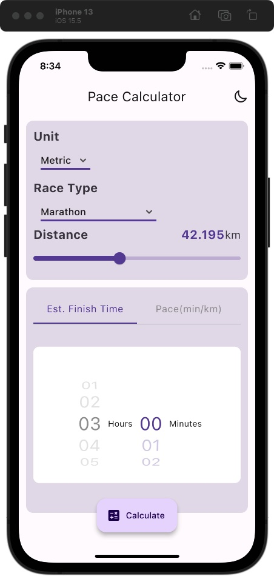
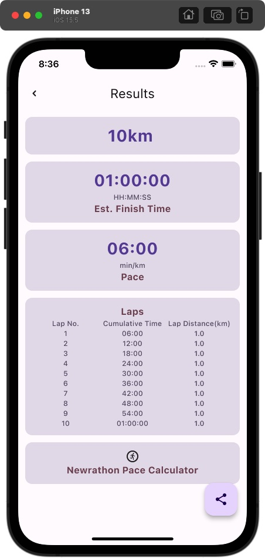
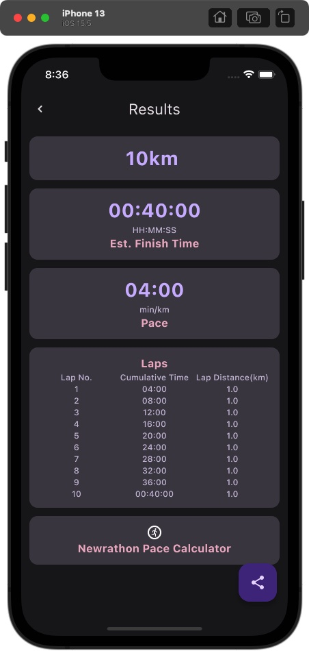

# Pace Calculator

Pace calcualtor is a simple app that calculates the pace for a running race.

<!--  -->

## Screenshots

 

## Build

[Build and release an Android app](https://docs.flutter.dev/deployment/android)

## License

[MIT](https://choosealicense.com/licenses/mit/)

## Credit

This app is developed based on [Macro Calculator](https://github.com/varadgauthankar/macro_calculator.git). Thanks~
